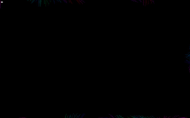

# P5.js Particle Flowfield Animation

A flowfield based animation realized by moving particles over a grid based field. It works similar to a flow field It renders much faster than [my first attempt](https://github.com/achjaderleon/p5js-pixel-flowfield).
This one is using an approach used in [The Coding Train's coding challange #24](https://www.youtube.com/watch?v=BjoM9oKOAKY).

You are able to change some basic parameters:

`DEBUG` enables you to display the flowfield and renders particles a without trails.

`FLOW_TILE_SIZE` sets the flowfield resolution by defining the size of a tile.

`FLOW_TILE_INFLUENCE` defines how strong a particle is moved by the field. While moving over a tile of the flowfield, the particles current direction is slowly interpolated towards the given direction of the flowfield. Define the amount of each interpolation step for each frame.

`FLOW_TILE_MOVEMENT` how fast the flowfield changes over time.

`PARTICLES_NUMBER` how many particles to render on screen. When a particles leaves the screen, a new one is created.

`PARTICLES_MAX_MAGNITUDE` how fast a particle can be. Is randomly chosen between 2 and this value.

Made with [P5.js](https://p5js.org/).

[Click here to show  in your browser.](http://htmlpreview.github.io/?https://github.com/achjaderleon/p5js-particle-flowfield/blob/master/index.html)

